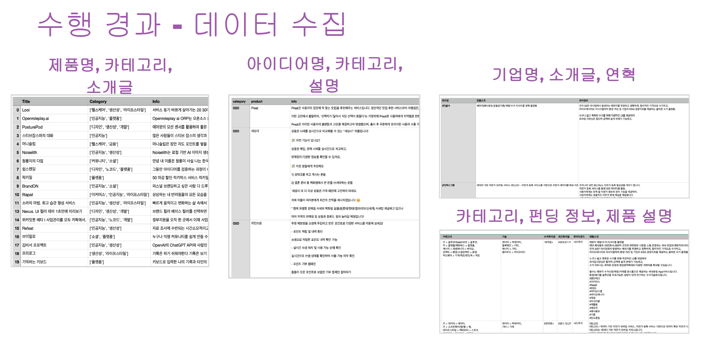
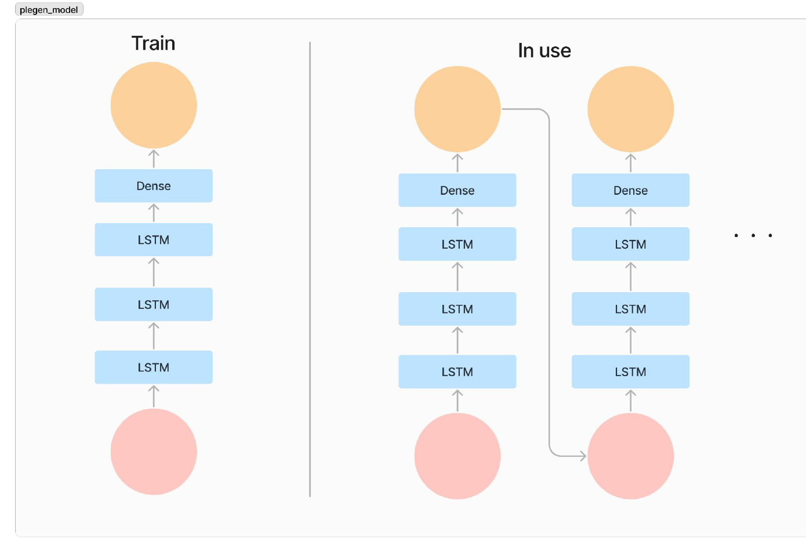
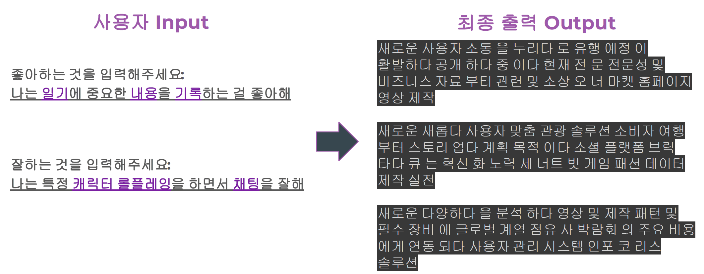

# 2차 프로젝트

## 프로젝트 아이디어 생성 AI <플젠>

## 프로젝트 개요
- 새로운 프로젝트 아이디어가 떠오르지 않을 때 사용자의 시장성 등을 입력하면 적합한 아이디어 제안해 주는 AI

## 프로젝트 기획 의도
- 직장인 10명 중 8명은 투잡의 의향이 있으며, 투잡을 해본 경우의 동기는 '새로운 일거리 탐색'의 비율이 55.8%를 차지 하였다.

## 활용 장비 및 재료
- 파이썬, 구글 코랩, 셀레니움, 판다스, 싸이킷런, 텐서플로우, Okt
- LSTM, Word2vec, Textrank

## 데이터 수집

## 데이터 전처리
- 각기 다른 파일 내용들을 [Product], [Category],[Info]로 데이터 통합
- 이상치 및 결측치 제거
- Okt를 사용하여 [Info] 컬럼 토큰화 및 불용어 제거 등
- 서로 다른 사이트에서 가져온 [Category]컬럼 데이터 통일, 중복 키워드 제거 등

## 모델링

## 생성 결과

